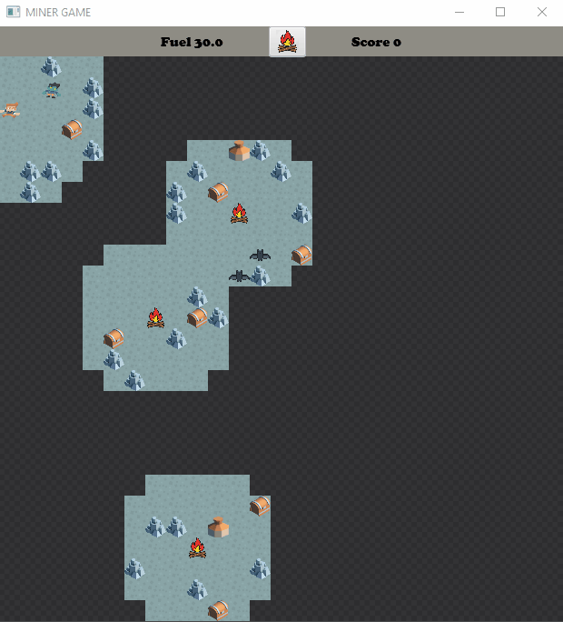

# Miner

Simple 2d consist of moving miner in dark and full of danger cave. Was made with the purpose of broaden knowledge of Java nad JavaFX.

## Technologies

Project is created with:
* Java version: 14.0.2 
* JavaFX version: 15.0.1
* Gson version: 2.8.6

## Setup

To run this project using IntelliJ install necessary libraries and add VM options:
* Linux/Mac

```
--module-path /path/to/javafx-sdk-15.0.1/lib --add-modules javafx.controls,javafx.fxml
```
* Windows
```
--module-path "\path\to\javafx-sdk-15.0.1\lib" --add-modules javafx.controls,javafx.fxml
```

If you use another programming environment, refer to [link](https://openjfx.io/openjfx-docs/) for more information.

## Game rules

Move miner with keyboard keys WASD to collect items, but not all of them:
* Canisters - to refuel
* Treasure chests - to score points
* Bats, Zombies - causing death
* Wormhole - to move to another cave
* Torch - gives light 

Fuel is limited, you can save it turning off your lamp by clicking ONOFF button. Fuel level is connected with field of view, you lose if it reaches 0 value. 

## Visuals


